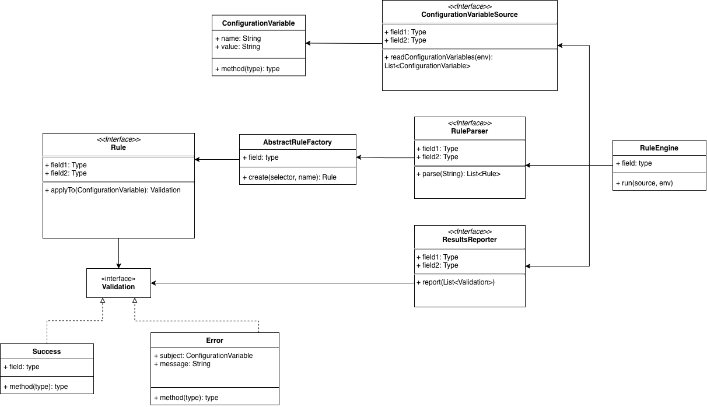

# configvalidator

A Java library that you can include in your IDE or tooling plugins to validate your
configuration variables.

## Documentation

You can read the source code and Javadocs.

For a list of available sources, parsers, reporters and rules; please consult
the [wiki](https://github.com/aloussase/configvalidator/wiki).

## Usage

The library is highly configurable to:

- **Pull configuration variables** from different sources
- **Parse rules** in different formats
- **Output results** in different ways

You can configure the `RuleEngine` at the time of instantiation with each:

```java
final var engine = new RuleEngine(reporter, parser, dataSource);
```

To see the available reporters, parsers and dataSources, consult the wiki.

Another option is to implement these interfaces yourself. The names of the
interfaces are:

- `ConfigurationVariableSource` to fetch configuration variables
- `ResultsReporter` to report validation results
- `RuleParser` to parse rules

You can consult the corresponding source code and Java doc for guidance on
how to implement these.

## Architecture



## Contributing

New ideas for rules, configuration sources, parsers; or anything else are welcome!

## License

MIT